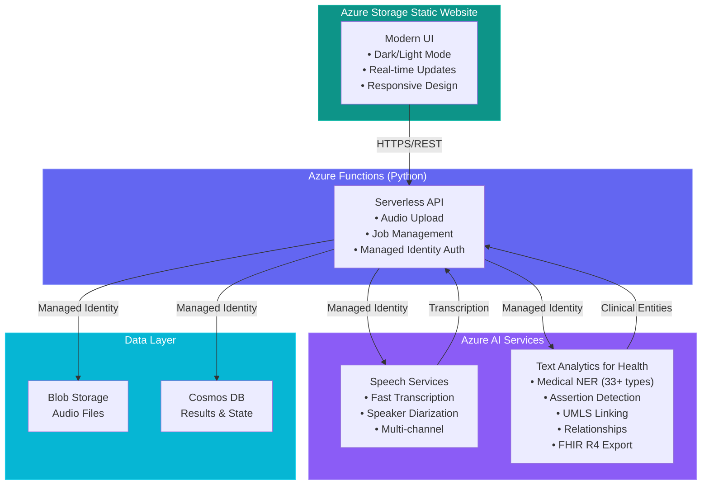

# HealthTranscribe

<div align="center">
  


**Enterprise-grade healthcare transcription and clinical entity extraction platform powered by Azure AI**

[](https://lemon-meadow-03ec82310.4.azurestaticapps.net/)
[](https://azure.microsoft.com)
[](LICENSE)

</div>

---

## Overview

HealthTranscribe is a production-ready, enterprise-grade application that transforms medical audio recordings into structured clinical data. Built with Azure AI Services, it delivers accurate transcription, intelligent medical entity extraction, relationship mapping, and standards-compliant FHIR R4 export — all through an intuitive, modern interface.

## Local Functions Runtime

Start the local Function app with `npm run start:functions` so Azure Functions Core Tools uses the project-local Python interpreter at `.venv/bin/python`. Starting `func` directly from a shell that is not activated against `.venv` can cause dependency mismatches during request handling.

## Authentication And Tenants

The React frontend now expects Easy Auth-backed sign-in for protected API routes and uses `/.auth/me` plus `/api/auth/session` to bootstrap identity, memberships, and the active tenant.

- In production, sign-in uses Easy Auth login endpoints such as `/.auth/login/aad` and `/.auth/login/google`.
- In local development, opt in explicitly to `LOCAL_DEV_AUTH=true` when you need local auth simulation, and make sure the Functions host uses the exact frontend origin with credentialed CORS: `CORS=http://127.0.0.1:4173` and `CORSCredentials=true`.
- If a user has one membership, the app auto-selects that tenant.
- If a user has multiple memberships, the app requires an active tenant selection before protected routes load.
- If a user has no memberships, the shell shows a first-tenant bootstrap flow backed by `POST /api/admin/tenants`.

All authenticated frontend HTTP requests stay cookie-based and the shared client automatically adds `X-Clinical-Tenant-Id` when an active tenant is selected.

## Voice Live Session Startup

Ambient Voice Live startup now performs an authenticated `POST /api/voice-sessions` exchange before opening the websocket. The backend stores a short-lived session document in the `platform_voice_sessions` container and returns a session token plus expiry timestamp for websocket startup.

## Operations And Data Governance

- Operational rollback and post-deploy checks are documented in `RUNBOOK.md`.
- Encounter, job, audio-retention, deletion, and UK-hosting posture are documented in `DATA-POLICY.md`.
- The primary production deploy smoke checks now validate both the dependency-aware `/api/health` JSON contract and an anonymous `POST /api/encounters` rejection to confirm auth protection remains active.


## Video Walkthrough

Watch a complete walkthrough demonstration of the system in action:

**[System Walkthrough Video](docs/AITranscriptionTextAnalyticsApp.mp4)**

This screencast demonstrates:
- End-to-end audio transcription workflow
- Medical entity extraction and visualization
- Relationship mapping between clinical entities
- FHIR R4 export functionality
- UI/UX features including dark mode

*Special thanks to [@hannahalisha1](https://github.com/hannahalisha1) for creating this comprehensive walkthrough.*

---

## Key Features

### **High-Accuracy Speech Transcription**
State-of-the-art audio-to-text conversion powered by Azure Speech Services Fast Transcription API.

**Supported Formats:**
- WAV, MP3, M4A, FLAC, OGG formats
- Multi-channel audio support
- Real-time processing feedback
- Batch transcription capabilities

**Advanced Audio Processing:**
- **Real-time Speaker Diarization** — Automatic speaker identification and separation
- **Multi-speaker Recognition** — Distinguish between doctor, patient, and other participants
- **Timestamp Precision** — Word-level timing for accurate playback sync


### **Medical Entity Recognition (NER)**
Advanced clinical entity extraction using Azure Text Analytics for Health, identifying **33+ entity types** with intelligent context:

| Category | Entities |
|----------|----------|
| **Medications** | Drug names, dosages, frequencies, routes, formulations |
| **Conditions** | Diagnoses, symptoms, diseases, disorders |
| **Procedures** | Treatments, surgeries, examinations, interventions |
| **Anatomy** | Body structures, organs, systems, locations |
| **Demographics** | Age, gender, ethnicity, occupation |
| **Clinical Attributes** | Measurements, test results, vital signs |
| **Healthcare Personnel** | Physicians, nurses, specialists, caregivers |

**Advanced Features:**
- **Assertion Detection** — Negation, uncertainty, and conditional detection (e.g., "no signs of infection")
- **UMLS Entity Linking** — Automatic linking to Unified Medical Language System codes
- **Confidence Scoring** — Entity extraction confidence levels


### **Intelligent Relationship Mapping**
Contextual analysis that connects related medical entities:

- **Drug → Dosage** — Medication quantities and administration
- **Condition → Body Structure** — Disease localization
- **Symptom → Time** — Temporal expressions
- **Measurement → Qualifier** — Clinical values with context
- **Procedure → Anatomy** — Treatment locations


### **FHIR R4 Standard Compliance**
Seamless healthcare interoperability with HL7 FHIR R4 Bundle export:

- Standards-compliant resource generation
- EHR system integration ready
- Complete observation and condition resources
- Privacy-preserving data structures


### **99% Cost Reduction**
Dramatic cost savings compared to traditional medical transcription services:

| Service | Cost per Minute | 100 Hours/Month |
|---------|----------------|-----------------|
| **Azure Speech (Batch)** | $0.003 | **$18** |
| **Azure Speech (Real-time)** | $0.017 | **$102** |
| Traditional Services | $0.79 | $4,740 |

**Monthly Savings:** Up to **$4,700** for 100 hours of transcription

### **Modern Enterprise UI/UX**
Professional, responsive interface with healthcare-focused design:

- **Dark/Light Mode** — System preference detection + manual toggle
- **Healthcare Color Palette** — Teal primary with indigo accents
- **Fully Responsive** — Desktop, tablet, and mobile optimized
- **Accessibility First** — WCAG 2.1 AA compliant
- **Real-time Updates** — Live processing status with progress tracking
- **Animated Feedback** — Smooth transitions and loading states

---

## Architecture



### Security Features

- **Zero Secrets Architecture** — All services use Azure Managed Identity
- **disableLocalAuth Enforced** — No API keys in code or configuration
- **RBAC** — Least-privilege role assignments
- **Network Security** — VNet integration ready
- **Audit Logging** — Application Insights monitoring
- **HIPAA Compliant** — Healthcare data handling best practices

---

## Quick Deploy

### **Prerequisites**

- Azure Subscription ([Create free account](https://azure.microsoft.com/free/))
- GitHub Account
- Azure CLI (optional, for manual deployment)

### **Option 1: Automated GitHub Actions Deploy** (Recommended)

**Step 1: Fork & Configure**
```bash
# Fork this repository to your GitHub account
# Then clone your fork locally
git clone https://github.com/<YOUR-USERNAME>/transcription-services-demo.git
cd transcription-services-demo
```

**Step 2: Create Azure Service Principal**
```bash
# Login to Azure
az login

# Create service principal (replace {subscription-id} with your subscription ID)
az ad sp create-for-rbac --name "github-transcription-sp" \
  --role owner \
  --scopes /subscriptions/{subscription-id} \
  --sdk-auth
```
**Copy the entire JSON output** — you'll need it next.

The infrastructure template creates RBAC role assignments. If you don't want to grant `Owner`, use a principal that has both `Contributor` and `User Access Administrator` at the deployment scope.

**Step 3: Configure GitHub Secrets**

Navigate to your repository: **Settings** → **Secrets and variables** → **Actions** → **New repository secret**

Add the following secret:
- **Name:** `AZURE_CREDENTIALS`
- **Value:** Paste the JSON from Step 2

**Step 4: Deploy Infrastructure**

1. Go to **Actions** tab in your repository
2. Select **"0. Deploy All (Complete)"** workflow
3. Click **"Run workflow"**
4. Enter parameters:
  - **Resource Group Name:** e.g., `healthtranscribe-uk-rg`
  - **Azure Region:** `uksouth`
5. Click **"Run workflow"** button

**Step 5: Add Deployment Tokens**

After infrastructure deployment completes (~5 minutes), add these secrets:

1. Get Function App name from workflow output

Add secrets:
- **Name:** `AZURE_FUNCTIONAPP_NAME` | **Value:** `<function-app-name>`

**Step 6: Deploy Application**

Run workflows in order:
1. **"Deploy Function App"** — Backend API
2. **"Deploy Frontend"** — Upload static assets to the UK South storage website

**Done!** Your application is now live.

---

### **Option 2: Manual Azure CLI Deploy**

```bash
# 1. Login and set subscription
az login
az account set --subscription <subscription-id>

# 2. Create resource group
az group create --name healthtranscribe-uk-rg --location uksouth

# 3. Deploy infrastructure
az deployment group create \
  --resource-group healthtranscribe-uk-rg \
  --template-file infra/main.bicep \
  --parameters environment=prod location=uksouth

# 4. Deploy Function App
cd <project-root>
func azure functionapp publish <function-app-name> --python

# 5. Configure frontend runtime endpoints without dropping Voice Live settings
VOICELIVE_GATEWAY_BASE_URL=https://<voice-live-gateway-host> \
  ./configure-frontend.sh https://<function-app-name>.azurewebsites.net/api

# 6. Deploy frontend to the static website
cd frontend-react
npm ci
npm run build
cd ..

az storage blob upload-batch \
  --account-name <frontend-storage-account-name> \
  --auth-mode login \
  --destination '$web' \
  --source ./frontend-react/dist \
  --overwrite
```

---

## Project Structure

```
transcription-services-demo/
├── .github/
│   └── workflows/              # CI/CD Pipelines
│       ├── deploy-all.yml      # Complete deployment workflow
│       ├── deploy-infrastructure.yml
│       ├── deploy-function.yml
│       └── deploy-frontend.yml
│
├── frontend-react/             # Primary React frontend (Vite)
│   ├── public/
│   │   ├── config.js          # Runtime API and Voice Live config
│   │   └── logo.png           # HealthTranscribe logo
│   ├── src/                   # React application source
│   ├── package.json           # Frontend scripts and dependencies
│   └── dist/                  # Production build output
│
├── infra/                      # Infrastructure as Code
│   └── main.bicep             # Azure Bicep template (all resources)
│
├── docs/                       # Screenshots and documentation
│   ├── dashboard.png
│   ├── upload-interface.png
│   ├── medical-entities.png
│   ├── relationships.png
│   ├── fhir-export.png
│   └── dark-mode.png
│
├── function_app.py            # Azure Functions backend
├── requirements.txt           # Python dependencies
├── host.json                  # Functions runtime config
└── README.md                  # This file
```

---

## API Reference

### Endpoints

| Endpoint | Method | Description | Auth |
|----------|--------|-------------|------|
| `/api/health` | GET | Health check and service status | None |
| `/api/upload` | POST | Upload audio file for processing | None |
| `/api/status/{job_id}` | GET | Get job status and results | None |

### Upload Audio File

**Request:**
```http
POST /api/upload
Content-Type: multipart/form-data

file: <audio-file>
```

**Response:**
```json
{
  "job_id": "uuid-string",
  "status": "submitted",
  "message": "File uploaded successfully"
}
```

### Get Job Status

**Request:**
```http
GET /api/status/{job_id}
```

**Response:**
```json
{
  "job_id": "uuid-string",
  "status": "completed",
  "transcription": "Patient presents with...",
  "entities": [...],
  "relationships": [...],
  "fhir_bundle": {...}
}
```

**Status Values:** `submitted`, `processing`, `completed`, `failed`

---

## Azure Resources

| Resource | SKU/Tier | Purpose | Cost (Est.) |
|----------|----------|---------|-------------|
| **Storage Account** | Standard_LRS | Audio files, function storage | ~$0.02/GB/month |
| **Cosmos DB** | Serverless | Job state and results | Pay-per-request |
| **Speech Services** | S0 | Fast transcription API | $0.003-0.017/min |
| **Language Service** | S | Text Analytics for Health | ~$1/1000 records |
| **Function App** | EP1 Premium | Serverless backend API | ~$200/month |
| **App Service Plan** | EP1 | Function App hosting | Included |
| **Frontend Storage Website** | Standard_LRS | UK-only frontend hosting | Minimal storage cost |
| **Application Insights** | Pay-as-you-go | Monitoring and diagnostics | ~$2.30/GB |

**Total Estimated Cost:** ~$210-250/month (processing 100 hours of audio)

### Resource Configuration

All resources are configured with:
- **Managed Identity** for authentication
- **RBAC** role assignments
- **disableLocalAuth** enforced (no keys)
- **Application Insights** integration
- **Diagnostic logging** enabled

---

## Local Development

### Setup

```bash
# Clone repository
git clone https://github.com/<your-username>/transcription-services-demo.git
cd transcription-services-demo

# Create Python virtual environment
python -m venv .venv

# Activate virtual environment
# Windows:
.venv\Scripts\activate
# Linux/Mac:
source .venv/bin/activate

# Install dependencies
pip install -r requirements.txt

# Install Azure Functions Core Tools
npm install -g azure-functions-core-tools@4

# Install root helper dependencies and frontend packages
npm install
cd frontend-react && npm install
```

### Configure Local Settings

```bash
# Create local settings file
cp local.settings.example.json local.settings.json
```

Edit `local.settings.json`:
```json
{
  "IsEncrypted": false,
  "Values": {
    "AzureWebJobsStorage": "UseDevelopmentStorage=true",
    "FUNCTIONS_WORKER_RUNTIME": "python",
    "AZURE_SPEECH_ENDPOINT": "https://<your-speech>.cognitiveservices.azure.com/",
    "AZURE_SPEECH_REGION": "uksouth",
    "AZURE_LANGUAGE_ENDPOINT": "https://<your-language>.cognitiveservices.azure.com/",
    "AZURE_OPENAI_ENDPOINT": "https://<your-openai>.openai.azure.com/",
    "AZURE_OPENAI_DEPLOYMENT": "gpt-4o-mini",
    "COSMOS_ENDPOINT": "https://<your-cosmos>.documents.azure.com:443/",
    "STORAGE_ACCOUNT_NAME": "<your-storage-account-name>",
    "STORAGE_ACCOUNT_NAME": "<your-storage-account>"
  }
}
```

For local auth simulation, explicitly set `LOCAL_DEV_AUTH=true` in `local.settings.json` only for development sessions. Do not keep that flag enabled in shared or production-facing settings.

Because the React frontend calls `/api/auth/session` with `credentials: 'include'`, local Azure Functions cannot use wildcard CORS. For the local auth gate to enter the app successfully, set the Functions host values exactly as follows:

```json
"Host": {
  "LocalHttpPort": 7072,
  "CORS": "http://127.0.0.1:4173",
  "CORSCredentials": true
}
```

If `CORS` is `"*"` or `CORSCredentials` is `false`, the browser will block both `/.auth/me` and `/api/auth/session`, and clicking `Recheck session` will leave the user on the auth gate.

### Run Locally

```bash
# Start storage emulator
npm run start:storage

# In another terminal, start Azure Functions backend
npm run start:functions

# Point the frontend at the local API
npm run configure:frontend:local

# In another terminal, start frontend
cd frontend-react
npm run dev -- --host 127.0.0.1
```

Backend runs on `http://localhost:7072`  
Frontend runs on `http://127.0.0.1:5173`

If you change `local.settings.json`, restart the Functions host before testing the auth gate again.

### Fast Local Test Loop Before Staging

Use this flow to avoid wasting staging build time:

1. Start Azurite locally so Azure Functions has `AzureWebJobsStorage`.
2. Start the Function app from the repo-local `.venv` and Core Tools install.
3. Point `frontend-react/public/config.js` at the local API with `npm run configure:frontend:local`.
4. Run the React frontend from `frontend-react/` and verify upload, ambient drawer state transitions, and health/API calls.
5. Only switch back to the deployed API when you want an integration check against Azure.

To point the frontend at the deployed Azure Function App instead of local Functions, use either of these:

```bash
./configure-frontend.sh <function-app-name>
./configure-frontend.sh https://<function-app-name>.azurewebsites.net/api
```

This lets you run three useful pre-staging modes:

1. Local frontend + local Functions for the fastest development loop.
2. Local frontend + deployed Azure API to test UI changes against real cloud services.
3. Deployed frontend + deployed API for final staging/production verification.

---

## Testing

### Test Health Endpoint
```bash
curl http://localhost:7072/api/health
```

The health endpoint returns structured JSON with `status`, `configuration`, and dependency-specific status entries. Production deploys should fail if the overall status is `degraded`.

### Staging Smoke Script

Run the combined staging smoke checks against a deployed API and frontend in one command:

```bash
./scripts/staging-smoke.sh \
  --api-base-url https://<function-app-name>.azurewebsites.net/api \
  --frontend-url https://<static-website-url>/
```

By default this verifies anonymous staging behavior:
- `GET /api/health` returns healthy JSON
- `GET /api/auth/session` returns `401`
- `POST /api/voice-sessions` returns `401`
- frontend landing page loads
- `config.js` contains the runtime API URL and Voice Live settings

For authenticated tenant-scoped checks, provide a session header and tenant id:

```bash
./scripts/staging-smoke.sh \
  --api-base-url https://<function-app-name>.azurewebsites.net/api \
  --frontend-url https://<static-website-url>/ \
  --auth-header 'Cookie: AppServiceAuthSession=<value>' \
  --tenant-id <tenant-id> \
  --expected-default-tenant-id <default-tenant-id>
```

### Test Upload
```bash
curl -X POST http://localhost:7072/api/upload \
  -F "file=@sample-audio.wav"
```

### Test Status
```bash
curl http://localhost:7072/api/status/<job-id>
```

---

## Monitoring & Observability

### Application Insights

All telemetry is sent to Azure Application Insights:
- **Request metrics** — API call rates and latencies
- **Exception tracking** — Error rates and stack traces
- **Custom events** — Job processing stages
- **Dependency tracking** — Azure service calls

### Key Metrics to Monitor

| Metric | Alert Threshold | Action |
|--------|----------------|---------|
| Function execution time | > 30s | Scale up or optimize |
| Failed requests | > 5% | Check logs |
| Speech API errors | > 2% | Verify quotas |
| Cosmos RU consumption | > 80% allocated | Scale up |

### Viewing Logs

```bash
# Stream function logs
func azure functionapp logstream <function-app-name>

# Query Application Insights
# Azure Portal → Application Insights → Logs
traces
| where severityLevel > 1
| order by timestamp desc
```

---

## Configuration

### Environment Variables

**Function App:**
- `AZURE_SPEECH_ENDPOINT` — Azure Speech Services endpoint
- `AZURE_LANGUAGE_ENDPOINT` — Azure Language Services endpoint
- `AZURE_OPENAI_ENDPOINT` — Azure OpenAI endpoint
- `AZURE_OPENAI_DEPLOYMENT` — Azure OpenAI deployment name
- `COSMOS_ENDPOINT` — Cosmos DB endpoint
- `STORAGE_ACCOUNT_NAME` — Blob storage account name

**Frontend static website:**
- `window.APP_CONFIG.apiBaseUrl` in `frontend-react/public/config.js` — Function App URL injected during deployment
- `window.APP_CONFIG.voiceLive.gatewayBaseUrl` in `frontend-react/public/config.js` — Base URL of the Voice Live websocket gateway used by the ambient assistant drawer
- `window.APP_CONFIG.voiceLive.wsPath` in `frontend-react/public/config.js` — Websocket path on the Voice Live gateway, default `/ws`
- `window.APP_CONFIG.voiceLive.instructions` in `frontend-react/public/config.js` — Ambient scribe instructions sent when the live voice session starts

### Ambient Assistant Realtime Config

To enable live ambient transcript streaming in the Assistant drawer, configure the Voice Live gateway in `frontend-react/public/config.js`:

```javascript
window.APP_CONFIG.voiceLive = {
  gatewayBaseUrl: 'https://your-voice-live-gateway.example.com',
  wsPath: '/ws',
  mode: 'model',
  model: 'gpt-realtime',
  voiceType: 'azure-standard',
  voice: 'en-US-Ava:DragonHDLatestNeural',
  transcribeModel: 'gpt-4o-transcribe',
  inputLanguage: 'en',
  instructions: 'You are an ambient clinical scribe. Do not greet, answer, or speak unless explicitly instructed. Focus on transcribing the live clinician and patient conversation accurately.'
};
```

If the Voice Live gateway is not configured, the drawer still supports the draft review and transcript-first clinical processing flow, but transcript text must be entered or pasted manually.

### Ambient Audio-to-Draft Flow

The ambient assistant now captures browser audio locally during live sessions. When the clinician clicks **Stop Recording** the captured audio is submitted to the backend for server-side transcription using the same Azure Speech Fast Transcription API (with diarization) that the file-upload pipeline uses. This produces a higher-quality draft with speaker labels, replacing the provisional websocket transcript.

**How it works:**

1. **Start Recording** — microphone PCM is buffered locally in the browser *and* streamed to the Voice Live gateway for a provisional live transcript.
2. **Stop Recording** — the local PCM buffer is assembled into a WAV file and POSTed to `POST /api/encounters/{id}/audio`.
3. The backend uploads the WAV to Blob Storage, calls `transcribe_audio_rest()` with diarization enabled, and writes the result into the encounter.
4. The frontend replaces the provisional draft with the server-returned transcript and displays the detected speaker count.
5. **Process Clinically** — the clinician reviews and approves the draft, then entity extraction, relation mapping, summaries, and FHIR export run on the approved text with the stored diarization metadata.

| Aspect | Direct file upload | Ambient capture |
|---|---|---|
| Transcription engine | Azure Speech Fast Transcription | Same |
| Diarization | Yes | Yes |
| Draft review step | No (immediate processing) | Yes — clinician approval required |
| Clinical processing trigger | Automatic after upload | Explicit **Process Clinically** click |

### Frontend Behavior

The supported frontend is `frontend-react/`. Update runtime endpoints in `frontend-react/public/config.js`, and adjust feature behavior in the relevant modules under `frontend-react/src/`.

---

## Documentation & Resources

### Azure Services
- [Azure Speech Services Documentation](https://learn.microsoft.com/azure/ai-services/speech-service/)
- [Fast Transcription API Guide](https://learn.microsoft.com/azure/ai-services/speech-service/fast-transcription-create)
- [Text Analytics for Health](https://learn.microsoft.com/azure/ai-services/language-service/text-analytics-for-health/overview)
- [FHIR Integration Guide](https://learn.microsoft.com/azure/ai-services/language-service/text-analytics-for-health/concepts/fhir)
- [Azure Functions Python Developer Guide](https://learn.microsoft.com/azure/azure-functions/functions-reference-python)
- [Managed Identity Best Practices](https://learn.microsoft.com/azure/active-directory/managed-identities-azure-resources/overview)

### Healthcare Standards
- [HL7 FHIR R4 Specification](http://hl7.org/fhir/R4/)
- [HIPAA Compliance on Azure](https://learn.microsoft.com/azure/compliance/offerings/offering-hipaa-us)
- [Healthcare Interoperability](https://learn.microsoft.com/industry/healthcare/healthcare-data-solutions)

### Development Tools
- [Azure Functions Core Tools](https://learn.microsoft.com/azure/azure-functions/functions-run-local)
- [Azure Storage static website hosting](https://learn.microsoft.com/azure/storage/blobs/storage-blob-static-website)
- [Azure Bicep Documentation](https://learn.microsoft.com/azure/azure-resource-manager/bicep/)

---

## Contributing

Contributions are welcome! Please follow these guidelines:

1. **Fork** the repository
2. Create a **feature branch** (`git checkout -b feature/amazing-feature`)
3. **Commit** your changes (`git commit -m 'feat: add amazing feature'`)
4. **Push** to the branch (`git push origin feature/amazing-feature`)
5. Open a **Pull Request**

### Code Style
- Python: Follow [PEP 8](https://pep8.org/)
- JavaScript: Use ES6+ features, semicolons required
- CSS: BEM naming convention preferred

---

## Troubleshooting

### Common Issues

**Issue:** Function deployment fails with authentication error  
**Solution:** Verify service principal has Contributor role on subscription

**Issue:** Speech API returns 401 Unauthorized  
**Solution:** Check Function App managed identity has `Cognitive Services User` role

**Issue:** Dark mode not persisting  
**Solution:** Clear browser localStorage and refresh page

**Issue:** Large files fail to upload  
**Solution:** Increase `maxAllowedContentLength` in Function App configuration

### Getting Help

- Check [Azure Documentation](https://learn.microsoft.com/azure/)
- Open an [Issue](https://github.com/samueltauil/transcription-services-demo/issues)
- Contact support

---

## License

This project is licensed under the **MIT License** - see the [LICENSE](LICENSE) file for details.

---

## Acknowledgments

- **[@hannahalisha1](https://github.com/hannahalisha1)** for creating the comprehensive system walkthrough video
- **Azure AI Services** for Speech and Language capabilities
- **Microsoft Healthcare** team for FHIR integration guidance
- **Open Source Community** for inspiration and best practices

---

<div align="center">

**Built with Azure**

[](https://portal.azure.com/#create/Microsoft.Template/uri/https%3A%2F%2Fraw.githubusercontent.com%2Fsamueltauil%2Ftranscription-services-demo%2Fmain%2Finfra%2Fmain.bicep)

[Live Demo](https://lemon-meadow-03ec82310.4.azurestaticapps.net/) • [Report Bug](https://github.com/samueltauil/transcription-services-demo/issues) • [Request Feature](https://github.com/samueltauil/transcription-services-demo/issues)

</div>
